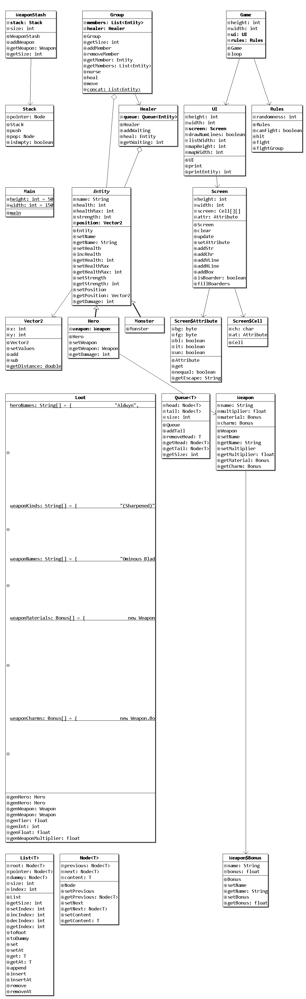

# RPG
Das RPG-Projekt ist im Unterricht entstanden und enthält folgende Klassen.

## Main:
In der "Main" Klasse ist der "entry point" des Projekts enthalten. Es werden einige Parameter festgelegt und an die "Game" Klasse übergeben.
## Game:
Die "Game" Klasse kümmert sich um alle weiteren Ausführungsschritte im Program. Ähnlich wie ein Arduino Projekt gibt es eine "setup" und eine "loop" Methode. In der "loop" wird ein fester Spielablauf festgelegt. Dieser ist nicht wirklich von Benutzereingaben abhängig. Dies ist aber sehr simpel zu implementieren. Ich hatte aber nicht die Zeit, da ich diese Version des Projekts zurückgelassen habe, um mich einer komplexeren Grafikoberfläche zuzuwenden. Diese ist aber noch nicht präsentierfähig. Aus diesem Grund ist der Spielablauf minder komplex.

## Entity:
Alle Lebewesen in dem Spiel stammen von der "Entity" Klasse ab. Dies erleichtert jegleche Interaktion zwischen selbigen, den alle Methoden, welche heilen oder kämpfen, oder auch die "Group" Klasse, müssen sich nur auf eine Klasse beziehen. Die verhindert Quellcodedopplung zwischen "Hero" und "Monster".
## Monster:
Die "Monster" Klasse hat keine weiteren Fähigkeiten. Die Besonderheiten unterschiedlicher "Monster" wird durch den Konstruktor festgelegt.
## Hero:
Die "Hero" Klasse erweitert die "Entity" Klasse um die Fähigkeit "Weapon" Klassenobjekte zu halten und modifiziert die Schadenmethoden um dies wiederzuspiegeln.

## Weapon:
Die "Weapon" Klasse stellt einen Multiplikator zu Verfügung auf welche mit einem Standartangriffswert multipliziert werden kann. Dieser Faktor ist von Boni abhängig, welche ihn verandern können.

## Loot:
Die "Loot" Klasse erstellt "Hero"s und "Weapon"s mit der Hilfe von zufälligen Werten, welche sich einheitlich auf die Parameter beziehen. Sie wird verwendet um alle Helden zu erstellen.

## Queue:
## Stack:
## List:
## Node:

## Group:
## Healer:
## WeaponStash:

## Rules:

## Screen:
## UI:
## Vector2:
