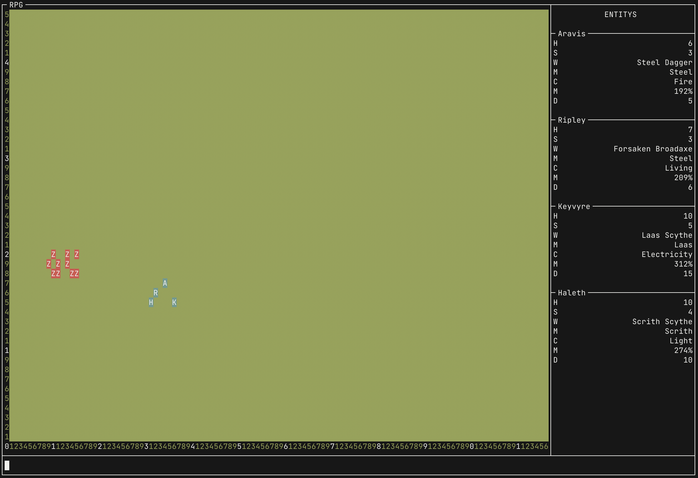

# RPG
Das RPG-Projekt ist im Unterricht entstanden und enthält folgende Klassen.

### Achtung
Dieses Projekt kann nicht mit dem Java-Editor ausgeführt werden. Der Nutzter muss in einem Terminal die [Release-Datei](https://github.com/canis-git/rpg/releases), mit dem Befehl "java -jar Rpg.jar" ausführen, er ist ebenfallse in der "Makefile" Datei enthalten. Es werden leichte Modifikationen benötigt um nicht ASCII Zeichen zu eliminieren. Außerdem ist der Output an eine Unix System angepasst und hat unter Windows leichte Nebeneffekte. Ich hoffe, sie können sich an die Demonstation im Unterricht erinnern, sonst bildet der Screenshot die Benutzteroberfläche noch einmals ab.

## Main:
In der "Main" Klasse ist der "entry point" des Projekts enthalten. Es werden einige Parameter festgelegt und an die "Game" Klasse übergeben.
## Game:
Die "Game" Klasse kümmert sich um alle weiteren Ausführungsschritte im Program. Ähnlich wie ein Arduino Projekt gibt es eine "setup" und eine "loop" Methode. In der "loop" wird ein fester Spielablauf festgelegt. Dieser ist nicht wirklich von Benutzereingaben abhängig. Dies ist aber sehr simpel zu implementieren. Ich hatte aber nicht die Zeit, da ich diese Version des Projekts zurückgelassen habe, um mich einer komplexeren Grafikoberfläche zuzuwenden. Diese ist aber noch nicht präsentierfähig. Aus diesem Grund ist der Spielablauf minder komplex.

## Entity:
Alle Lebewesen in dem Spiel stammen von der "Entity" Klasse ab. Dies erleichtert jegleche Interaktion zwischen selbigen, den alle Methoden, welche heilen oder kämpfen, oder auch die "Group" Klasse, müssen sich nur auf eine Klasse beziehen. Die verhindert Quellcodedopplung zwischen "Hero" und "Monster".
## Monster:
Die "Monster" Klasse hat keine weiteren Fähigkeiten. Die Besonderheiten unterschiedlicher "Monster" wird durch den Konstruktor festgelegt.
## Hero:
Die "Hero" Klasse erweitert die "Entity" Klasse um die Fähigkeit "Weapon" Klassenobjekte zu halten und modifiziert die Schadenmethoden um dies wiederzuspiegeln.

## Weapon:
Die "Weapon" Klasse stellt einen Multiplikator zu Verfügung auf welche mit einem Standartangriffswert multipliziert werden kann. Dieser Faktor ist von Boni abhängig, welche ihn verandern können.

## Loot:
Die "Loot" Klasse erstellt "Hero"s und "Weapon"s mit der Hilfe von zufälligen Werten, welche sich einheitlich auf die Parameter beziehen. Sie wird verwendet um alle Helden zu erstellen.

## Queue:
Die "Queue", "Stack" und "List" Klasses sind alle Implementationen von dynamischen Datenstrukturen, sie sind alle generisch und verwalten Daten mit Hilfe der "Node" Klasse. Die "Queue" ist eine Datenstruktur hach dem *first in first out* Prinzip. Sie bietet sich, wie dem Namen nach, an um Warteschlangen festzuhalten und um eine feste Reinfolge von Daten zu behalten.
## Stack:
Der "Stack" ähnelt der "Queue", funktioniert aber nach dem *last in first out* Prinzip. Er findet in der Arbeitsspeicheraufteilung in den meisten Betriebssystemen eine wichtige Rolle.
## List:
Die "List" Klasse implementiert eine lineare Liste, welche durch einen internen "Pointer" auf eine Kette von Datensegmenten zugreifen kann. Sie ist die komplexeste der drei Datenstrukturen.
## Node:
Die "Node" Klasse wird von allen drei vorherigen Klassen verwendet um Datenpunkte mit Referenzen zu jeweils benachbarten Datenpunkten zu versehen. Sie ist wie alle vier Klassen generisch.

## Group:
Die drei folgenden Klassen implementieren nun die drei vorhergegangenen Konzepte im Kontext des RPGs. Beginnent mit der "Group" Klasse, welche sich der "List" bedient um "Entity"s zu verwalten. Diese können nun als Verband agieren und interagieren.
## Healer:
Der "Healer" ist eine Klasse, welche in der "Group" enthalten ist. Er implementier die "Queue" um verwundete "Entity"s der Reihe nach wieder auf ihre uhrsprüngliche Lebenspunkte zurückzusetzen.
## WeaponStash:
Der "WeaponStash" ist die letzte der drei Implementationen und bietet die Möglichkeit Waffen zu speichern und wieder abzurufen. Diese Aktion funktioniert nach Prinzip des "Stack"s.

## Rules:
Die "Rules" Klasse ist für die Verwaltung der Spielzüge verantwortlich. Momentan gibt es ausschließlich eine Handlung, und zwar das Kämpfen. Die Kampfregel lässt die enzlnen "Entity"s entweder in Gruppen oder einzelnt gegen einander kämpfen.
## Dice:
Die "Dice" Klasse stellt ein benutzerfreungliches Interface zu Verfügung, welches das Handhaben von Zufallszahlen erleichtert. Diese Klasse wird in meinem Projekt aber nicht angewendet, da viele zufällige Prozesse Dezimalzahlen zwischen 1 und 0 bedürfen und der Wechsel zwischen "Dice" und "Random" für Unleserlichkeiten und Verwirrung gesorgt hätte.

## Screen:
Die "Screen" Klasse lässt den Programierer auf einzelne "Cell"en des Terminalbildschirms zugreifen. Es werden viele Funktionen bereit gestellt um das Anzeigen von "String"s oder anderen Zeichen zu vereinfachen. Zum Beispiel gibt es die Möglichkeit sehr elegant Umramungen und anderere Grenzen zu visualisieren. Jede "Cell"e hatt eine Anzahl von Attributen, welche Eigenschaften welche die Ausgabe Fett, Kursiv, Unterstrichen und in verschiedenen auftreten lasse.
## UI:
Die "UI" Klase implementiert nun, ähnlich wie bei "List" und "Group", die Funktionnen aus der "Screen" Klasse. Das Design für Spielbrett und Heldenanzeige ist hier festgelegt. Die "UI" Klasse wird benutzt um vom "Game" aus dem Benutzter den aktuellen Stand anzuzeigen.
## Vector2:
Die "Vector2" Klasse stellt eine einfache Möglichkeit dar die Position eines Objektes in der Spielwelt festzuhalten. Leider wird er in diesem Projekt nur selten verwendet, in meiner aktuellen Version wird er aber vermehrt Anwendung finden.

